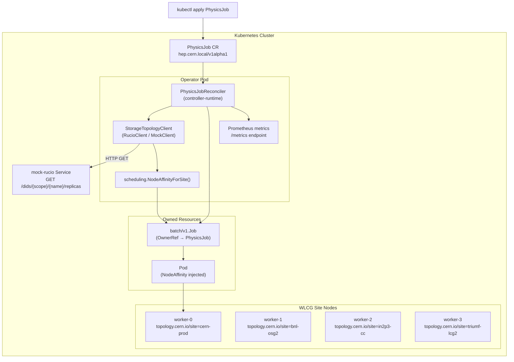

# Architecture

## Problem

The WLCG (Worldwide LHC Computing Grid) operates a Data Lake model where petabytes
of detector data are centralised at large Rucio Storage Elements (RSEs) distributed
across Tier-1 sites: CERN, BNL, IN2P3-CC, SARA, TRIUMF, GridKA, INFN-T1 and others.

Standard `kube-scheduler` has no awareness of storage topology. Left to its own
devices it places compute pods on nodes with spare CPU/RAM, which can be thousands
of kilometres away from the data — forcing every job to stream gigabytes or terabytes
across the WAN before processing can begin.

`data-gravity-operator` solves this by injecting `NodeAffinity` constraints that
pin compute to the Kubernetes worker node co-located with the dataset's primary RSE,
before the Job ever reaches the scheduler.

---

## Component Map



---

## Reconcile Loop

```
Reconcile(ctx, req):

  1. Get PhysicsJob — return nil on NotFound (already deleted)
  2. If phase ∈ {Succeeded, Failed} — terminal, return
  3. If status.jobRef != "" — syncFromJob() and return
  4. Set phase = Resolving; Status.Update()
  5. StorageClient.Resolve(spec.dataset) → []ReplicaInfo
     └─ empty slice → setFailed("RSENotFound")
  6. replica = replicas[0]   (highest-priority RSE)
  7. if policy != AnyAvailable:
        affinity = NodeAffinityForSite(replica.SiteLabel)
  8. Create batch/v1.Job with OwnerReference and affinity
     └─ IsAlreadyExists → idempotent, continue
  9. Status.Update(phase=Scheduled, resolvedRSE, jobRef, bytesTransferAvoided)

syncFromJob(ctx, pj):
  1. Get owned Job by jobRef name
     └─ NotFound → setFailed("JobDeleted")
  2. Map Job conditions → PhysicsJob phase:
        JobComplete=True  → Succeeded
        JobFailed=True    → Failed
        Active > 0        → Running
        else              → Scheduled
  3. If phase changed → Status.Update()
```

---

## Scheduling Policies

| Policy | Behaviour |
|--------|-----------|
| `DataLocal` (default) | Requires `topology.cern.io/site` = RSE site of the primary replica. Pod will not start if no matching node exists. |
| `ClosestSite` | Same as `DataLocal` for a single replica; future extension point for a geo-distance ranking. |
| `AnyAvailable` | No `NodeAffinity` injected. Scheduler places the pod freely. RSE is still resolved and recorded for observability. |

---

## Data Flow: bytes avoided

When `schedulingPolicy` is `DataLocal` or `ClosestSite`, the operator:

1. Records `DatasetSizeBytes` (from the Rucio replica response) in:
   - `PhysicsJob.status.bytesTransferAvoided`
   - `physjob_data_transfer_avoided_bytes{rse}` Prometheus counter

This gives operations teams a cumulative view of WAN bandwidth saved by
co-locating compute with data.

---

## Prometheus Metrics

| Metric | Type | Labels | Description |
|--------|------|--------|-------------|
| `physjob_reconcile_total` | Counter | `result` | All reconcile calls, labelled `success` or `error` |
| `physjob_reconcile_duration_seconds` | Histogram | — | Wall-clock time of each reconcile call |
| `physjob_resolved_total` | Counter | `rse`, `policy` | Successful DID → RSE resolutions |
| `physjob_resolution_failures_total` | Counter | `reason` | RSE resolution failures by reason code |
| `physjob_data_transfer_avoided_bytes` | Counter | `rse` | Cumulative bytes of WAN transfer avoided |

---

## Repository Layout

```
api/v1alpha1/               CRD type definitions — PhysicsJobSpec, PhysicsJobStatus
internal/controller/        Reconciler (PhysicsJobReconciler) + Ginkgo/envtest suite
internal/storage/           StorageTopologyClient interface + RucioClient HTTP client
internal/scheduling/        NodeAffinity builder (topology.cern.io/site)
internal/metrics/           Prometheus metric registrations
internal/mockrucio/         Mock Rucio HTTP handler + ATLAS/CMS/LHCb seed data
cmd/main.go                 Operator manager entrypoint
cmd/mock-rucio/main.go      Standalone mock-rucio server binary
config/crd/bases/           Generated CRD YAML (hep.cern.local_physicsjobs.yaml)
config/rbac/                Generated ClusterRole YAML
config/samples/             Example PhysicsJob CRs
deploy/                     kind cluster config + mock-rucio Kubernetes manifest
helm/data-gravity-operator/ Helm chart for production deployment
scripts/                    setup-env.sh, setup-kind.sh, demo.sh
docs/                       This document
```
